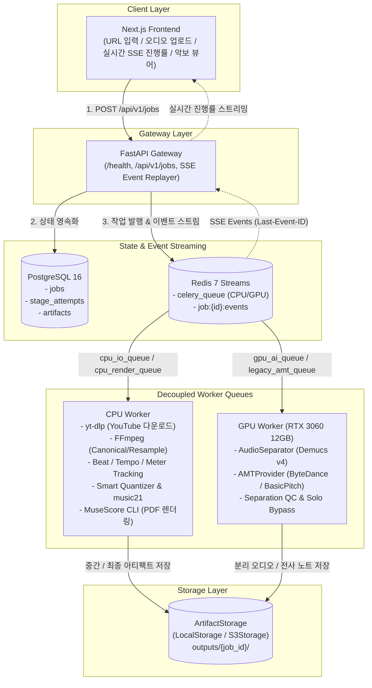

# 🎵 MusicSheet

> **AI 기반 음원 분리 및 자동 악보 생성 시스템 (Audio-to-Score AI Pipeline)**  
> YouTube URL 또는 오디오 파일을 입력받아, 대상 악기(피아노)를 분리하고 음표 단위로 정밀 전사하여 **출판급 PDF 악보, MusicXML, MIDI**를 자동 생성하는 엔지니어링 파이프라인.

---

## 📌 주요 특징

- **고정밀 악기 분리 (Source Separation):** Meta Demucs v4 (`htdemucs_6s`) 기반 피아노 스템 추출 및 솔로 피아노 감지 시 왜곡을 방지하는 **QC & Solo Bypass** 탑재.
- **SOTA 피아노 전사 (AMT):** 화음(Polyphonic), 벨로시티(Velocity), 서스테인 페달(Pedal CC64)을 보존하는 고해상도 신경망 전사 (`ByteDance Piano AMT` / `Spotify Basic Pitch`).
- **스마트 퀀타이즈 (Smart Quantization):** 고정 16분음표 스냅의 한계를 넘어선 **비용 함수(Cost-function) 기반 리듬 최적화** 및 양손 보표(Grand Staff: Treble/Bass) 자동 분할.
- **다단계 신뢰도(Confidence Fusion):** 음원 분리 품질, 전사 신뢰도, 리듬 적합도를 음표별로 영구 추적하여 에러 누적 차단 및 향후 Human-in-the-loop 에디터 지원.
- **비동기 큐 & 분리 워커:** 단일 GPU(RTX 3060 12GB) 환경 최적화를 위해 **CPU I/O 큐, GPU AI 큐, CPU 렌더 큐**를 물리적으로 분리한 고성능 아키텍처.
- **재접속 복원 실시간 스트리밍:** Redis Streams (`XADD`) 기반 SSE(Server-Sent Events)를 통해 브라우저 단절 시에도 진행률 유실 없이 복구.
- **초고속 패키지 관리 (`uv`):** Astral `uv` 기반 워크스페이스를 채택하고, 최신 생태계(Python 3.12)와 레거시 모델(Python 3.10)의 런타임 분리 실행.

---

## 🏗️ 전체 시스템 아키텍처



---

## 🛠️ 기술 스택 (Tech Stack)

| 영역 | 기술 스택 | 설명 |
| :--- | :--- | :--- |
| **언어 & 런타임** | **Python 3.12** (기본) / **3.10** (레거시 격리) | Astral `uv` 멀티 런타임 패키지 관리 |
| **백엔드 API** | **FastAPI**, Pydantic v2 | 비동기 고성능 REST API 및 SSE 엔드포인트 |
| **작업 큐 & 오케스트레이션**| **Celery**, **Redis 7** (Streams + Broker) | CPU/GPU Worker 분리 큐, 멱등성 보장 (`acks_late`) |
| **데이터베이스** | **PostgreSQL 16** | 작업 마스터(`jobs`), 재시도/실행 이력(`stage_attempts`) |
| **음악 AI 모델** | **Demucs v4**, **ByteDance Piano AMT**, **Basic Pitch** | 음원 분리 및 고해상도 폴리포닉 전사 |
| **음악이론 & 렌더링** | **music21**, **librosa 1.0+**, **MuseScore 4 CLI** | 비트 그리드, 비용 기반 퀀타이즈, 벡터 PDF 렌더링 |
| **프론트엔드** | **Next.js (App Router)**, OSMD (확장 예정) | 반응형 웹 UI, 오디오 플레이어 및 악보 뷰어 |

---

## 📋 필수 사전 요구사항 (Prerequisites)

1. **NVIDIA GPU:** RTX 3060 12GB (또는 8GB+ VRAM CUDA 지원 GPU)
2. **Astral `uv`:** [uv 공식 설치 가이드](https://github.com/astral-sh/uv)
3. **Docker & Docker Compose:** PostgreSQL 및 Redis 구동용
4. **외부 CLI 도구:**
   - **FFmpeg:** 오디오 트랜스코딩 및 리샘플링 (`ffmpeg -version`)
   - **MuseScore 4:** MusicXML ➔ PDF 무인 렌더링 (`musescore --version`)

---

## 🚀 빠른 시작 가이드 (Quick Start)

### 1. 레포지토리 클론 및 Python 런타임 설치
```bash
git clone https://github.com/your-org/MusicSheet.git
cd MusicSheet

# 메인(3.12) 및 레거시 모델용(3.10) 파이썬 자동 설치
uv python install 3.12 3.10

# 메인 가상환경 생성 및 의존성 동기화
uv venv --python 3.12
uv sync

# PyTorch CUDA 12.1 설치 (RTX 3060 최적화)
uv pip install torch torchvision torchaudio --index-url https://download.pytorch.org/whl/cu121
```

### 2. 인프라 컨테이너 실행 (PostgreSQL & Redis)
```bash
docker compose -f docker/docker-compose.yml up -d
```

### 3. 사전 모델 가중치 프리페치 (부팅 전 1회 실행)
```bash
uv run python scripts/prefetch_models.py
```

### 4. 서비스 실행

```bash
# 터미널 1: FastAPI 백엔드 서버 (포트 8000)
uv run --python 3.12 uvicorn apps.api.main:app --host 0.0.0.0 --port 8000 --reload

# 터미널 2: CPU Worker (I/O, 비트분석, 악보 렌더링)
uv run --python 3.12 celery -A packages.pipeline.workers.celery_app worker -Q cpu_io_queue,cpu_render_queue -c 4 -l info

# 터미널 3: GPU AI Worker (Demucs 음원 분리, Basic Pitch)
uv run --python 3.12 celery -A packages.pipeline.workers.celery_app worker -Q gpu_ai_queue -c 1 -l info

# 터미널 4: Legacy AMT Worker (ByteDance Piano 격리 워커)
uv run --python 3.10 celery -A packages.pipeline.workers.legacy_amt_worker worker -Q legacy_amt_queue -c 1 -l info
```

### 5. 헬스 체크 확인
브라우저 또는 curl로 시스템 상태를 점검합니다.
```bash
curl http://localhost:8000/health/detail
```

---

## 📂 프로젝트 구조 (Monorepo)

```text
MusicSheet/
├── pyproject.toml               # uv 루트 워크스페이스 및 공통 의존성 정의
├── uv.lock                      # 단일 진실 소스 의존성 락파일
├── .python-version              # 기본 런타임 버전 고정 (3.12)
├── README.md                    # 본 프로젝트 소개 및 안내서
│
├── apps/
│   ├── api/                     # FastAPI Backend Application
│   │   ├── api/v1/endpoints/    # /jobs, /health, /events
│   │   └── main.py              # 엔트리포인트
│   └── web/                     # Next.js Frontend
│
├── packages/
│   ├── common/                  # 공통 데이터 스키마 (JobStatus, NoteEvent, ArtifactRef)
│   ├── storage/                 # LocalStorage, S3Storage 어댑터
│   └── pipeline/                # 핵심 음악 AI 파이프라인
│       ├── adapters/            # Separator, AMT, Beat, Renderer Provider 어댑터
│       ├── filtering/           # Dynamic Filter & Quality Check
│       ├── quantizer/           # Cost-based Smart Quantizer & music21
│       └── workers/             # Celery Worker 태스크 정의
│
├── models/                      # 사전 다운로드된 AI 모델 체크포인트
├── outputs/                     # job_id별 중간 산출물 및 최종 악보 결과
├── scripts/
│   └── prefetch_models.py       # 모델 가중치 사전 다운로드 스크립트
├── docker/
│   └── docker-compose.yml       # PostgreSQL, Redis 컨테이너 정의
└── docs/                        # 모듈화된 Canonical Specifications
    ├── main_spec.md             # [Router] AI Agent 작업 규약 및 인덱스
    ├── architecture/            # 시스템, 파이프라인, 스토리지 구조
    ├── domain/                  # 상태 머신, 아티팩트, 3계층 노트 스키마
    ├── ai/                      # 분리, AMT, 비트, 퀀타이즈, 어댑터 명세
    ├── backend/                 # API, Celery, Redis Streams, DB 명세
    ├── infrastructure/          # 런타임, 도커, 헬스체크 명세
    └── adr/                     # 주요 아키텍처 결정 기록
```

---

## 📖 시스템 설계 문서 (Canonical Specs)

AI Agent 및 개발자는 **[docs/main_spec.md](./docs/main_spec.md)**를 진입점으로 삼아 현재 작업에 필요한 상세 스펙을 참조합니다.

- **시스템 아키텍처:** [docs/architecture/system.md](./docs/architecture/system.md)
- **작업 파이프라인 & 큐 라우팅:** [docs/architecture/job-pipeline.md](./docs/architecture/job-pipeline.md)
- **Job 상태 머신 & 전이 규칙:** [docs/domain/job-state.md](./docs/domain/job-state.md)
- **3계층 Note Event 스키마:** [docs/domain/note-events.md](./docs/domain/note-events.md)
- **음원 분리 & Solo Bypass:** [docs/ai/separation.md](./docs/ai/separation.md)
- **스마트 퀀타이즈 (비용함수):** [docs/ai/quantization.md](./docs/ai/quantization.md)
- **Python 런타임 전략 (uv):** [docs/infrastructure/runtime.md](./docs/infrastructure/runtime.md)

---

## 🗺️ 개발 로드맵 (Roadmap)

- **Phase 1 (MVP - 진행 중):**
  - 피아노 단일 타겟 파이프라인 (YouTube/Upload ➔ Demucs ➔ ByteDance ➔ music21 ➔ MuseScore PDF/MIDI)
  - Celery 분리 큐(CPU/GPU) 및 Redis Streams SSE 실시간 진행률 연동
  - 로컬 RTX 3060 12GB 환경 검증
- **Phase 2 (사용성 및 품질 고도화):**
  - OpenSheetMusicDisplay(OSMD) 기반 인터랙티브 웹 악보 뷰어 & 오디오 싱크 재생
  - 피아노 솔로 감지 자동 Bypass 알고리즘 고도화
- **Phase 3 (다중 악기 확장):**
  - 어쿠스틱 기타 (TAB 악보 생성), 일렉트릭 베이스, 보컬 멜로디 전사 확장
- **Phase 4 (Human-in-the-loop):**
  - Confidence 기반 저신뢰도 음표 하이라이팅 및 웹 악보 에디터

---

## 📄 라이선스 (License)

본 프로젝트는 [MIT License](LICENSE)를 따릅니다. 단, 외부 연동 모델 및 라이브러리(Meta Demucs, ByteDance Piano AMT, MuseScore 등)는 각각의 오픈소스 라이선스 정책을 준수합니다.
