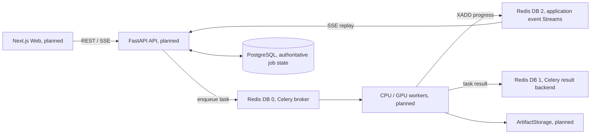

# MusicSheet

> 오디오에서 피아노 연주를 분리·전사해 악보를 만드는 시스템을 목표로 합니다.
> **현재 저장소는 기반 단계입니다.** Python 워크스페이스, 공용 Pydantic 스키마, PostgreSQL·Redis 개발용 Compose와 기초 테스트가 있습니다. API, worker, AI 파이프라인, 웹 앱은 아직 구현되지 않았습니다.

## 현재 구현 범위

| 영역 | 현재 저장소 |
| :--- | :--- |
| 런타임·패키지 관리 | Python 3.12, `uv` workspace |
| 공용 데이터 모델 | `packages/common/musicsheet_common/schemas/` |
| 개발 인프라 | PostgreSQL 16, Redis 7 (`docker/docker-compose.yml`) |
| 테스트 | 프로젝트 기반, Compose 설정, 공용 스키마 |
| API·스토리지 어댑터·worker·모델 추론·웹 앱 | 설계 문서만 있으며 미구현 |

`docs/`의 아키텍처와 운영 명령은 목표 설계를 설명합니다. 해당 구성 요소가 저장소에 추가되기 전까지 실행 가능한 안내로 취급하지 마세요.

## 개발 환경 시작

필요 항목: Python 3.12, Astral `uv`. PostgreSQL과 Redis를 로컬에서 띄우려면 Docker Compose도 필요합니다.

```bash
git clone https://github.com/reha-design/MusicSheet.git
cd MusicSheet
uv sync
docker compose -f docker/docker-compose.yml up -d
uv run pytest
```

`uv sync`는 현재 Python workspace를 동기화합니다. Compose는 PostgreSQL과 Redis만 시작합니다. `uv run pytest`는 저장소 테스트를 실행합니다. 이 단계에서는 API 서버나 Celery worker가 시작되지 않습니다.

GPU, FFmpeg, MuseScore, 모델 가중치 설치는 AI 파이프라인 구현 이후의 환경 설정입니다.

## 목표 아키텍처

아래 구성은 설계 목표이며 현재 실행 가능한 시스템을 나타내지 않습니다.



Celery 작업 브로커, Celery 결과 저장소, SSE 이벤트 Stream은 서로 다른 역할입니다. [Redis 이벤트 명세](docs/backend/redis-streams.md)를 참조하세요.

## 저장소 구조

```text
MusicSheet/
├── .agents/rules/       # 저장소 작업 규칙
├── docker/              # PostgreSQL·Redis Compose 설정
├── docs/                # 목표 사양과 작업 보고서
├── models/              # 모델 파일 위치
├── outputs/             # 작업 결과물 위치
├── packages/common/     # 공용 Pydantic 스키마
├── tests/               # 기반·인프라·스키마 테스트
├── .env.example
├── LICENSE              # MIT License
├── pyproject.toml       # Python 3.12 uv workspace
└── uv.lock
```

## 사양 문서

[문서 진입점](docs/main_spec.md)에서 작업별 사양을 찾을 수 있습니다.

- [시스템 구조](docs/architecture/system.md), [작업 파이프라인](docs/architecture/job-pipeline.md), [스토리지](docs/architecture/storage.md)
- [도메인 모델](docs/domain/job-state.md), [아티팩트](docs/domain/artifacts.md), [노트 이벤트](docs/domain/note-events.md), [악보 모델](docs/domain/score-model.md)
- [AI 단계](docs/ai/separation.md), [전사](docs/ai/transcription.md), [리듬](docs/ai/rhythm.md), [퀀타이즈](docs/ai/quantization.md), [어댑터](docs/ai/model-adapters.md)
- [API](docs/backend/api.md), [Celery](docs/backend/celery.md), [Redis Streams](docs/backend/redis-streams.md), [데이터베이스](docs/backend/database.md)
- [런타임](docs/infrastructure/runtime.md), [Docker](docs/infrastructure/docker.md), [헬스 체크](docs/infrastructure/health-check.md)

## 다음 개발 단계

베이스라인 다음 단계는 [베이스라인 작업 보고서](docs/reports/baseline-execution-report.md)의 제안에 따라 LocalStorage와 API 헬스 체크를 구현하는 것입니다.

## 라이선스

프로젝트는 [MIT License](LICENSE)를 따릅니다. 외부 모델과 라이브러리는 각자의 라이선스를 따릅니다.
