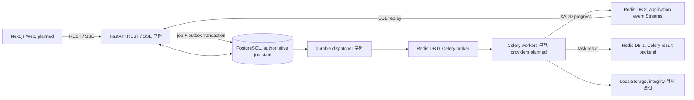

# MusicSheet

> 오디오에서 피아노 연주를 분리·전사해 악보를 만드는 시스템을 목표로 합니다.
> **현재 저장소에는 작업 등록 API·Celery 오케스트레이션·독립 전사 PoC가 있습니다.** 등록과 단계 전달·재시도·취소·이벤트 발행은 연결됐으며, 제품 provider는 후속 작업입니다. 실제 YouTube 처리·AI 연결·악보 생성과 실 Linux worker 성공 경로는 아직 미검증입니다.

## 현재 구현 범위

| 영역 | 현재 저장소 |
| :--- | :--- |
| 런타임·패키지 관리 | Python 3.13 공용 workspace와 독립 API 프로젝트, Basic Pitch worker용 독립 Python 3.12 환경 |
| 공용 데이터 모델 | `packages/common/musicsheet_common/schemas/` |
| 아티팩트 스토리지 | `ArtifactStorage`와 로컬 `LocalStorage` (`put`, `open_read`, `exists`, `delete`, `materialize`) |
| 개발 인프라 | PostgreSQL 16, Redis 7 (`docker/docker-compose.yml`) |
| PostgreSQL 작업 저장 | 명시적 migration, API connection pool, 작업·아티팩트 metadata repository |
| FastAPI | 상태 확인, YouTube/파일 업로드 작업 등록, 상태 조회·취소, 아티팩트 목록·다운로드 |
| 진행 이벤트 | 공용 Redis Streams store, SSE 재생, worker의 DB commit 후 발행 |
| Celery 오케스트레이션 | API 최초 outbox 예약, dispatcher, CPU/AI/render 여섯 task, 재시도·멱등·취소; 기본 provider는 빈 registry |
| Basic Pitch PoC | 별도 CLI worker가 ONNX CPU 추론 후 JSON/MIDI 생성 |
| 테스트 | 공용 스키마·스토리지·API 테스트, 선택형 PostgreSQL·Basic Pitch 통합 테스트 |
| 실제 다운로드·음원 분리·리듬/퀀타이즈·악보 렌더링·웹 앱 | provider 연결 및 기능 구현 대기 |

`docs/`의 아키텍처 문서에는 목표 설계도 포함됩니다. 병합된 구현과 남은 연결 작업은 [구현 현황 브리핑](docs/reports/current-implementation-briefing.md)에 정리했습니다.

## 개발 환경 시작

필요 항목: Python 3.13, Astral `uv`. PostgreSQL과 Redis를 로컬에서 띄우려면 Docker Compose도 필요합니다.

```bash
git clone https://github.com/reha-design/MusicSheet.git
cd MusicSheet
uv sync
docker compose -f docker/docker-compose.yml up -d
uv run pytest
```

`uv sync`는 기본 Python workspace와 LocalStorage 패키지를 동기화합니다. FastAPI와 Basic Pitch worker는 각각 독립 환경이므로 [API README](services/api/README.md)와 [worker README](services/ml/basic-pitch-worker/README.md)의 설치·실행 방법을 따릅니다. Compose는 PostgreSQL과 Redis만 시작합니다. `uv run pytest`는 루트 테스트만 실행하며 API 테스트는 별도로 실행해야 합니다.

분리, 악보 렌더링 등 아직 구현되지 않은 AI 파이프라인에는 FFmpeg, MuseScore, 모델 가중치가 필요할 수 있습니다. Basic Pitch PoC는 CPU용 ONNX Runtime을 별도 환경에서 사용합니다.

## 목표 아키텍처

아래 구성은 설계 목표이며 현재 실행 가능한 시스템을 나타내지 않습니다.


```mermaid
flowchart LR
    Web[Next.js Web, planned] -->|REST / SSE| API[FastAPI REST / SSE 구현]
    API -->|job + outbox transaction| PostgreSQL
    PostgreSQL --> Dispatcher[durable dispatcher 구현]
    Dispatcher --> Broker[Redis DB 0, Celery broker]
    Broker --> Workers[Celery workers 구현, providers planned]
    Workers -->|XADD progress| Events[Redis DB 2, application event Streams]
    Events -->|SSE replay| API
    API <--> PostgreSQL[(PostgreSQL, authoritative job state)]
    Workers -->|task result| Results[Redis DB 1, Celery result backend]
    Workers --> Storage[LocalStorage, integrity 검사 연결]
```

Celery 작업 브로커, Celery 결과 저장소, SSE 이벤트 Stream은 서로 다른 역할입니다. [Redis 이벤트 명세](docs/backend/redis-streams.md)를 참조하세요.

## 저장소 구조

```text
MusicSheet/
├── .agents/rules/       # 저장소 작업 규칙
├── docker/              # PostgreSQL·Redis Compose 설정
├── docs/                # 목표 사양과 작업 보고서
├── models/              # 모델 파일 위치
├── outputs/             # 작업 결과물 위치
├── packages/common/     # 공용 Pydantic 스키마
├── packages/storage/    # ArtifactStorage 및 LocalStorage
├── packages/pipeline/   # Celery·dispatcher·실행 엔진
├── services/api/         # 독립 FastAPI 프로젝트
├── services/ml/         # 격리된 Basic Pitch PoC worker
├── tests/               # 기반·인프라·스키마 테스트
├── .env.example
├── LICENSE              # MIT License
├── pyproject.toml       # Python 3.13 uv workspace
└── uv.lock
```

## 사양 문서

[문서 진입점](docs/main_spec.md)에서 작업별 사양을 찾을 수 있습니다.

- [시스템 구조](docs/architecture/system.md), [작업 파이프라인](docs/architecture/job-pipeline.md), [스토리지](docs/architecture/storage.md)
- [도메인 모델](docs/domain/job-state.md), [아티팩트](docs/domain/artifacts.md), [노트 이벤트](docs/domain/note-events.md), [악보 모델](docs/domain/score-model.md)
- [AI 단계](docs/ai/separation.md), [전사](docs/ai/transcription.md), [리듬](docs/ai/rhythm.md), [퀀타이즈](docs/ai/quantization.md), [어댑터](docs/ai/model-adapters.md)
- [API](docs/backend/api.md), [Celery](docs/backend/celery.md), [Redis Streams](docs/backend/redis-streams.md), [데이터베이스](docs/backend/database.md)
- [런타임](docs/infrastructure/runtime.md), [Docker](docs/infrastructure/docker.md), [헬스 체크](docs/infrastructure/health-check.md)
- [uv 독립 환경 구성 해설](docs/blog/uv-isolated-environments-in-monorepo.md), [구현 현황 브리핑](docs/reports/current-implementation-briefing.md)

## 다음 개발 단계

현재 활성 작업과 완료 기준은 [개발 작업목록](docs/roadmap.md)에서 관리합니다.

## 라이선스

프로젝트는 [MIT License](LICENSE)를 따릅니다. 외부 모델과 라이브러리는 각자의 라이선스를 따릅니다.
