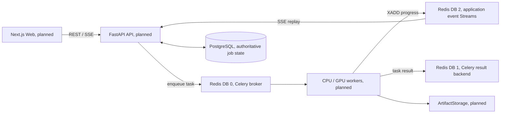

# MusicSheet

> 오디오에서 피아노 연주를 분리·전사해 악보를 만드는 시스템을 목표로 합니다.
> **현재 저장소에는 기반 구성과 두 개의 독립 실행 단위가 있습니다.** Python 3.13 workspace, 공용 Pydantic 스키마, LocalStorage 아티팩트 어댑터, 개발용 PostgreSQL·Redis Compose, 그리고 별도 Python 3.12 환경의 Basic Pitch CPU PoC worker가 있습니다. PoC는 JSON과 MIDI를 생성하지만 API·Celery 파이프라인에는 연결되지 않았습니다.

## 현재 구현 범위

| 영역 | 현재 저장소 |
| :--- | :--- |
| 런타임·패키지 관리 | 기본 Python 3.13 `uv` workspace, Basic Pitch worker용 독립 Python 3.12 환경 |
| 공용 데이터 모델 | `packages/common/musicsheet_common/schemas/` |
| 아티팩트 스토리지 | `ArtifactStorage`와 로컬 `LocalStorage` (`put`, `open_read`, `exists`, `materialize`) |
| 개발 인프라 | PostgreSQL 16, Redis 7 (`docker/docker-compose.yml`) |
| Basic Pitch PoC | 별도 CLI worker가 ONNX CPU 추론 후 JSON/MIDI 생성 |
| 테스트 | 스키마, 스토리지, Compose, 선택형 Basic Pitch 통합 테스트 |
| API·Celery 연결·음원 분리·리듬/퀀타이즈·악보 렌더링·웹 앱 | 설계 문서만 있으며 미구현 |

`docs/`의 아키텍처와 운영 명령은 목표 설계를 설명합니다. 구현 상태는 각 문서의 안내와 작업 보고서를 확인하세요.

## 개발 환경 시작

필요 항목: Python 3.13, Astral `uv`. PostgreSQL과 Redis를 로컬에서 띄우려면 Docker Compose도 필요합니다.

```bash
git clone https://github.com/reha-design/MusicSheet.git
cd MusicSheet
uv sync
docker compose -f docker/docker-compose.yml up -d
uv run pytest
```

`uv sync`는 기본 Python workspace와 LocalStorage 패키지를 동기화합니다. Basic Pitch worker는 별도 환경이므로 [worker README](services/ml/basic-pitch-worker/README.md)의 설치·실행 방법을 따릅니다. Compose는 PostgreSQL과 Redis만 시작합니다. `uv run pytest`는 기본 테스트를 실행하며 API 서버나 Celery worker를 시작하지 않습니다.

분리, 악보 렌더링 등 아직 구현되지 않은 AI 파이프라인에는 FFmpeg, MuseScore, 모델 가중치가 필요할 수 있습니다. Basic Pitch PoC는 CPU용 ONNX Runtime을 별도 환경에서 사용합니다.

## 목표 아키텍처

아래 구성은 설계 목표이며 현재 실행 가능한 시스템을 나타내지 않습니다.


```mermaid
flowchart LR
    Web[Next.js Web, planned] -->|REST / SSE| API[FastAPI API, planned]
    API -->|enqueue task| Broker[Redis DB 0, Celery broker]
    Broker --> Workers[CPU / GPU workers, planned]
    Workers -->|XADD progress| Events[Redis DB 2, application event Streams]
    Events -->|SSE replay| API
    API <--> PostgreSQL[(PostgreSQL, authoritative job state)]
    Workers -->|task result| Results[Redis DB 1, Celery result backend]
    Workers --> Storage[ArtifactStorage, planned]
```

Celery 작업 브로커, Celery 결과 저장소, SSE 이벤트 Stream은 서로 다른 역할입니다. [Redis 이벤트 명세](docs/backend/redis-streams.md)를 참조하세요.

## 저장소 구조

```text
MusicSheet/
├── .agents/rules/       # 저장소 작업 규칙
├── docker/              # PostgreSQL·Redis Compose 설정
├── docs/                # 목표 사양과 작업 보고서
├── models/              # 모델 파일 위치
├── outputs/             # 작업 결과물 위치
├── packages/common/     # 공용 Pydantic 스키마
├── packages/storage/    # ArtifactStorage 및 LocalStorage
├── services/ml/         # 격리된 Basic Pitch PoC worker
├── tests/               # 기반·인프라·스키마 테스트
├── .env.example
├── LICENSE              # MIT License
├── pyproject.toml       # Python 3.13 uv workspace
└── uv.lock
```

## 사양 문서

[문서 진입점](docs/main_spec.md)에서 작업별 사양을 찾을 수 있습니다.

- [시스템 구조](docs/architecture/system.md), [작업 파이프라인](docs/architecture/job-pipeline.md), [스토리지](docs/architecture/storage.md)
- [도메인 모델](docs/domain/job-state.md), [아티팩트](docs/domain/artifacts.md), [노트 이벤트](docs/domain/note-events.md), [악보 모델](docs/domain/score-model.md)
- [AI 단계](docs/ai/separation.md), [전사](docs/ai/transcription.md), [리듬](docs/ai/rhythm.md), [퀀타이즈](docs/ai/quantization.md), [어댑터](docs/ai/model-adapters.md)
- [API](docs/backend/api.md), [Celery](docs/backend/celery.md), [Redis Streams](docs/backend/redis-streams.md), [데이터베이스](docs/backend/database.md)
- [런타임](docs/infrastructure/runtime.md), [Docker](docs/infrastructure/docker.md), [헬스 체크](docs/infrastructure/health-check.md)

## 다음 개발 단계

현재 활성 작업과 완료 기준은 [개발 작업목록](docs/roadmap.md)에서 관리합니다.

## 라이선스

프로젝트는 [MIT License](LICENSE)를 따릅니다. 외부 모델과 라이브러리는 각자의 라이선스를 따릅니다.
