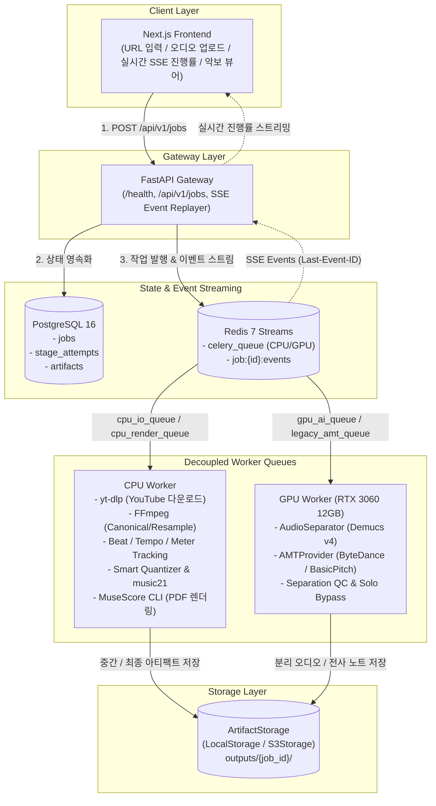

# Architecture Spec: System Overview

> **Canonical Owner:** `docs/architecture/system.md`  
> **관련 문서:** [docs/architecture/job-pipeline.md](./job-pipeline.md), [docs/backend/api.md](../backend/api.md)

---

## 1. 시스템 물리 구성도

---

## 2. 컴포넌트별 책임

| 컴포넌트 | 기술 스택 | 주 책임 |
| :--- | :--- | :--- |
| **Frontend** | Next.js (App Router), Vanilla CSS | 오디오/URL 입력 수신, SSE 기반 실시간 프로그레스 표시, MusicXML/PDF 뷰어 |
| **API Gateway** | FastAPI (Python 3.12) | 작업 생성/조회/취소 REST API 제공, SSE 스트림 중계, 헬스체크 노출 |
| **State DB** | PostgreSQL 16 | 작업의 단일 진실 소스(Job Status, Stage Attempts, Artifact 메타데이터) 영속화 |
| **Event / Queue Broker**| Redis 7 (Streams + Celery Broker) | 작업 큐 메시징, 재생 가능한(Replayable) 진행률 이벤트 스트리밍 |
| **CPU Worker** | Python 3.12, Celery | I/O 중심 작업(다운로드, 리샘플링), 비트 분석, 퀀타이즈, MuseScore 악보 렌더링 |
| **GPU Worker** | Python 3.12 (Modern) / Python 3.10 (Legacy), PyTorch | Demucs 음원 분리 추론, ByteDance/BasicPitch AMT 고부하 신경망 연산 |
| **Artifact Storage** | LocalStorage (MVP) ➔ S3Storage | 단계별 중간 음원, JSON 노트, 완성된 MIDI/MusicXML/PDF 영속 파일 저장 |
