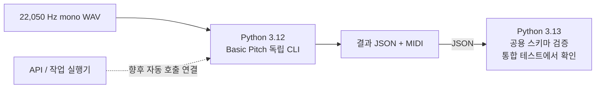

# 하나의 저장소에서 Python 환경을 나누는 법: uv로 API와 AI 모델 분리하기

API 서버는 Python 3.13에서 잘 동작하는데, 함께 사용할 AI 모델은 Python 3.12와 특정 추론 라이브러리 조합에서 검증되어 있다면 어떻게 구성해야 할까?

MusicSheet는 오디오를 피아노 악보로 변환하는 프로젝트다. API와 공용 데이터 모델은 Python 3.13을 사용하고, Basic Pitch 전사 모델은 Python 3.12와 ONNX Runtime으로 실행한다. 코드는 한 Git 저장소에서 관리하면서, 실행환경은 독립된 uv 프로젝트로 나누었다.

그 선택의 이유부터 디렉터리 구성, 명령 사용법, 환경 사이의 데이터 전달까지 살펴보자.

> 사례 기준: 2026-09-26~27의 MusicSheet 검증 기록과 프로젝트 설정. 예시는 저장소 루트의 Windows PowerShell 기준이다. 명령은 uv 공식 문서와 로컬 uv 0.10.11 도움말로 확인했으며, 설치·추론 결과는 기존 보고서에서 인용한다.

## 1. API와 AI 모델의 Python 버전이 다르다면

API의 주요 관심사는 HTTP 요청, 데이터 검증, DB 연결이다. AI 모델에는 학습 프레임워크, 추론 엔진, 오디오 처리 라이브러리 등이 필요하다. 프로젝트가 커질수록 이 두 영역의 업데이트 주기와 호환성 조건이 달라질 수 있다.

패키지의 지원 Python 버전도 다르고, 운영체제에 맞는 설치 파일이 제공되는지도 확인해야 한다. GPU를 사용한다면 드라이버와 CUDA 조합까지 고려해야 한다. Python 숫자 하나를 맞추는 것만으로 모든 의존성 문제가 해결되지는 않는다.

MusicSheet에서는 공용 스키마와 스토리지를 Python 3.13으로 유지하면서, Basic Pitch만 독립된 Python 3.12 환경에서 시험했다. 당시 검토한 upstream 수정 커밋을 고정하고 ONNX CPU 추론 경로를 검증한 결정이다. 자세한 범위는 [Python 3.12 worker 예외 ADR](../adr/005-basic-pitch-python-312-exception.md)에 기록되어 있다.

이 사례가 Basic Pitch는 반드시 Python 3.12에서만 실행된다는 뜻은 아니다. 이 프로젝트가 재현한 조합이 무엇인지 명시한 것이다. 더 높은 Python 버전을 채택하려면 그 조합의 설치와 실제 추론을 검증하면 된다. 환경을 분리하면 이런 모델 실험을 진행하면서 API의 Python 버전을 독립적으로 유지할 수 있다.

## 2. Git 저장소와 Python 환경을 각각 결정하기

Git 저장소는 어떤 코드를 함께 버전 관리할지 정한다. Python 실행환경은 어떤 인터프리터와 패키지 조합으로 코드를 실행할지 정한다. 두 경계를 항상 일치시킬 필요는 없다.

| 구성 | 코드 관리 | 의존성·환경 관리 | 어울리는 상황 |
| --- | --- | --- | --- |
| 모노레포 안의 uv workspace | 하나의 Git 저장소 | workspace가 lockfile과 기본 환경을 공유 | 관련 패키지를 함께 개발하고 의존성도 함께 맞출 때 |
| 독립 uv 프로젝트 모노레포 | 하나의 Git 저장소 | 프로젝트별 lockfile과 환경 | 코드는 함께 바꾸지만 실행 조건이 다를 때 |
| 멀티레포 | 여러 Git 저장소 | 각 프로젝트가 환경을 관리 | 팀 소유권·릴리스·접근 권한까지 독립적일 때 |

uv workspace의 각 멤버도 자기 `pyproject.toml`을 갖는다. 그러나 의존성은 workspace 전체를 고려해 해석하고 lockfile을 공유한다. Python 지원 범위는 멤버들의 `requires-python` 교집합이다. 각각 `>=3.13,<3.14`와 `>=3.12,<3.13`을 요구한다면 함께 실행할 Python 버전이 없다. [uv workspace 공식 문서](https://docs.astral.sh/uv/concepts/projects/workspaces/)

MusicSheet에서는 API와 데이터 계약을 함께 수정하는 일이 많다. 이를 여러 저장소로 나누면 공용 패키지 배포와 소비 서비스 업데이트를 조율해야 한다. 모노레포를 유지하면 관련 변경을 한 번에 검토하면서, 설치되는 패키지는 서비스별로 관리할 수 있다.

## 3. 환경 하나에는 무엇이 들어 있을까

uv 프로젝트에서 자주 보이는 네 가지 파일·디렉터리는 역할이 다르다.

| 파일·디렉터리 | 역할 | Git 관리 |
| --- | --- | --- |
| `pyproject.toml` | 프로젝트 정보, 지원 Python 범위, 의존성 요구사항 | 포함 |
| `uv.lock` | 해석된 패키지 버전과 의존성 정보를 기록 | 포함 |
| `.python-version` | 기본으로 선택할 Python 버전 요청 | 이 프로젝트에서는 포함 |
| `.venv/` | 실제 실행에 사용하는 가상환경과 설치 패키지 | 제외하고 각 PC에서 재생성 |

`pyproject.toml`에 패키지 버전 범위를 적고, `uv.lock`에 구체적인 의존성 해석 결과를 남긴다. `.venv`는 그 정보를 바탕으로 구성되는 실행환경이다. 새 PC로 옮길 때는 환경 디렉터리를 복사하기보다 저장소의 설정과 lockfile을 받아 다시 설치한다. [uv 프로젝트 파일 설명](https://docs.astral.sh/uv/concepts/projects/layout/)

`.python-version`의 `3.13`은 기본 인터프리터 선택에 사용하는 요청이다. `requires-python = ">=3.13,<3.14"`는 프로젝트가 허용하는 Python 범위다. 전자는 선택, 후자는 호환성 조건을 표현한다. `--python 3.12`를 붙여도 Python 3.13만 허용하는 프로젝트의 제약이 사라지지는 않는다. [uv Python 버전 관리](https://docs.astral.sh/uv/concepts/python-versions/)

패치 버전까지 재현하려면 `3.13.7`처럼 지정하고 운영체제와 uv 버전도 기록한다. GPU 드라이버와 시스템 프로그램은 lockfile 밖의 실행 조건이므로 별도로 관리한다.

## 4. MusicSheet의 실제 구성

현재 구조는 root workspace와 독립 서비스 프로젝트가 공존하는 형태다. 아래 `.venv`는 각 프로젝트를 동기화할 때 만들어지는 위치를 표시한다.

```text
MusicSheet/                              # 하나의 Git 저장소
├── pyproject.toml                       # root workspace, Python 3.13
├── uv.lock
├── .python-version                     # 3.13
├── .venv/
├── packages/
│   ├── common/pyproject.toml            # root workspace 멤버
│   └── storage/pyproject.toml           # root workspace 멤버
└── services/
    ├── api/                            # 독립 프로젝트, Python 3.13
    │   ├── pyproject.toml
    │   ├── uv.lock
    │   ├── .python-version             # 3.13
    │   └── .venv/
    └── ml/basic-pitch-worker/           # 독립 프로젝트, Python 3.12
        ├── pyproject.toml
        ├── uv.lock
        ├── .python-version             # 3.12
        └── .venv/
```

루트 설정의 workspace 멤버는 다음 두 패키지다.

```toml
[tool.uv.workspace]
members = ["packages/common", "packages/storage"]
```

API와 Basic Pitch worker는 여기에 포함되지 않는다. 루트의 `uv sync` 한 번으로 세 환경 전체를 설치하는 구조도 아니다. API에는 FastAPI와 DB 클라이언트를 설치하고, 모델 worker에는 Basic Pitch와 ONNX Runtime을 설치한다.

API와 루트는 같은 Python 3.13을 사용하지만 lockfile은 따로 갖는다. API 의존성을 공용 패키지 개발 환경과 독립적으로 관리하기 위해서다. 이 API 구성은 이미 구현되어 있으며, [FastAPI 구현 보고서](../reports/fastapi-health-check-implementation-report.md)에 기록되어 있다.

## 5. uv로 독립 프로젝트 만들고 실행하기

### 처음 프로젝트를 만드는 경우

uv가 설치되어 있다고 가정한다. 다음 생성 명령은 해당 서비스 디렉터리가 아직 없는 새 저장소에서 구조를 만드는 예시다. 기존 MusicSheet를 clone했다면 다음 절의 동기화 명령부터 사용한다.

```powershell
uv python install 3.13 3.12
uv init --package --no-workspace --python 3.13 services/api
uv init --package --no-workspace --python 3.12 services/ml/basic-pitch-worker
```

`--no-workspace`는 생성 시 부모 프로젝트의 workspace에 자동 편입되는 것을 피한다. `--package`는 패키지 빌드와 설치를 위한 구성을 만든다. 이 명령으로 생기는 것은 프로젝트 골격이며, 모델 실행 코드와 의존성은 별도로 구성해야 한다. [uv init 옵션](https://docs.astral.sh/uv/reference/cli/#uv-init)

생성 후에는 두 프로젝트의 지원 범위를 확인한다. `uv init --python 3.12`만으로 상한 `<3.13`까지 지정되는 것은 아니다. MusicSheet가 사용하는 범위는 다음과 같다. 아래는 각 파일에서 확인할 항목만 발췌한 것이다.

```toml
# services/api/pyproject.toml의 [project] 항목
requires-python = ">=3.13,<3.14"
```

```toml
# services/ml/basic-pitch-worker/pyproject.toml의 [project] 항목
requires-python = ">=3.12,<3.13"
```

부모 workspace에 `services/*` 같은 넓은 멤버 패턴이 있다면 포함·제외 설정도 살펴봐야 한다. 독립 프로젝트 경로가 workspace 멤버로 잡히지 않아야 한다. 폴더에 `.venv`를 하나 더 만드는 것만으로 의존성 관리 경계가 바뀌지는 않는다.

새 프로젝트에서 의존성 선언을 마친 뒤 최초 lockfile과 환경을 생성할 때는 일반 `uv sync`를 사용한다.

```powershell
uv sync --project services/api --python 3.13
uv sync --project services/ml/basic-pitch-worker --python 3.12
```

### 기존 프로젝트를 설치하고 실행하는 경우

MusicSheet를 받은 뒤에는 이미 커밋된 설정과 lockfile을 사용한다. Basic Pitch도 일반 패키지를 임의로 추가하기보다, 검증에 사용한 Git 커밋이 명시된 worker 설정으로 복원한다.

```powershell
uv sync --project . --locked --python 3.13
uv sync --project services/api --locked --python 3.13
uv sync --project services/ml/basic-pitch-worker --locked --python 3.12
```

`--locked`는 lockfile 변경이 필요하면 오류로 알린다. 개발 중 의존성을 변경할 때와 기존 구성을 그대로 복원할 때를 구분하는 옵션이다. [uv locking과 syncing](https://docs.astral.sh/uv/concepts/projects/sync/)

API는 다음처럼 시작한다. 이 경로 예시는 저장소 루트를 기준으로 한다.

```powershell
$env:LOCAL_STORAGE_DIR = "./outputs"
uv run --project services/api --locked --python 3.13 musicsheet-api
```

worker는 별도 PowerShell 터미널에서 실행한다. 예시는 저장소의 22,050 Hz mono WAV fixture를 사용하며, 출력 경로는 매번 새 이름을 만든다.

```powershell
$blogOutputDir = "temp/basic-pitch-blog-$([guid]::NewGuid().ToString('N'))"
uv run --project services/ml/basic-pitch-worker --locked --python 3.12 basic-pitch-worker `
  --input-audio tests/fixtures/audio/basic_pitch_smoke.wav `
  --output-dir $blogOutputDir
```

`uv run`은 프로젝트 환경에서 명령을 실행하므로 터미널마다 가상환경을 수동 활성화하는 절차를 줄일 수 있다. [uv 실행 안내](https://docs.astral.sh/uv/concepts/projects/run/)

여기서 `--project`는 환경을 선택할 프로젝트 위치를 지정한다. 이미 workspace 멤버인 프로젝트를 독립 프로젝트로 바꾸는 옵션은 아니다. 또 작업 디렉터리는 바꾸지 않으므로 위 입력 파일의 상대 경로는 저장소 루트 기준이다. 이 차이를 놓치면 환경은 맞아도 입력 파일이나 테스트 경로를 잘못 찾을 수 있다. [uv 명령 경로 옵션](https://docs.astral.sh/uv/reference/cli/#uv-run--project)

## 6. 공용 코드와 데이터를 연결하는 방법

환경을 분리하면 공용 코드를 어떻게 사용할지도 정해야 한다. MusicSheet의 API는 Python 3.13용 `common`과 `storage` 패키지를 로컬 경로 의존성으로 사용한다. 다음은 API 설정의 일부다.

```toml
[project]
dependencies = [
    "musicsheet-common",
    "musicsheet-storage",
]

[tool.uv.sources]
musicsheet-common = { path = "../../packages/common", editable = true }
musicsheet-storage = { path = "../../packages/storage", editable = true }
```

`editable = true`는 개발 중 로컬 소스를 참조하는 설치 방식이다. 일반적인 Python 소스 변경을 매번 패키지로 다시 배포하지 않고 사용할 수 있다. 실행 중인 서버는 변경 적용을 위해 재시작이나 reload가 필요할 수 있고, 의존성 선언 변경에는 재동기화가 필요하다. [uv editable 의존성](https://docs.astral.sh/uv/concepts/projects/dependencies/#editable-dependencies)

같은 연결을 명령으로 추가한다면, 저장소 루트에서 다음처럼 실행한다. 명령의 입력 경로는 현재 디렉터리 기준이고, 설정에 기록된 `../../packages/common`은 API 프로젝트 기준이다.

```powershell
uv add --project services/api --editable --no-workspace ./packages/common
```

이때 `uv add`의 `--no-workspace`는 추가하는 로컬 의존성을 workspace 멤버로 등록하지 않고 path dependency로 취급하게 한다. `uv init`에서의 생성 제어와 적용 대상이 다르다. [uv add 옵션](https://docs.astral.sh/uv/reference/cli/#uv-add--no-workspace)

API가 공용 패키지를 설치했다고 해서 루트 `.venv`를 빌려 쓰는 것은 아니다. API 환경에서 필요한 의존성을 해석하고 설치하면서 같은 소스 경로를 참조한다. 공용 코드가 바뀌면 이를 사용하는 여러 환경에서 함께 검증해야 한다. 배포할 때도 상대 경로로 참조한 패키지가 빌드에 포함되도록 구성해야 한다.

Python 3.12 worker에는 현재 Python 3.13을 요구하는 `common` 패키지를 그대로 설치할 수 없다. MusicSheet는 worker가 계약에 맞는 JSON을 기록하고, Python 3.13 쪽에서 공용 Pydantic 모델로 그 JSON을 검증하도록 구성했다.



JSON에는 schema version, 모델 출처 정보, note event 등이 포함된다. 양쪽은 같은 Python 객체를 공유하는 대신 어떤 필드와 값이 오가는지 합의한다. 계약을 바꾸면 생성하는 쪽과 검증하는 쪽을 함께 검토해야 하므로, 환경 분리에는 이 경계를 관리하는 비용도 따른다.

2026-09-26의 [실제 추론 보고서](../reports/basic-pitch-worker-smoke-report.md)는 Windows에서 JSON/MIDI를 만들고 Python 3.13 스키마로 결과를 검증한 기록이다. 현재 API 환경과 모델 CLI는 존재하지만, API·Celery에서 worker를 자동 호출하는 제품 연결은 후속 작업이다.

## 7. 분리한 환경을 유지하는 방법

의존성을 바꾸기 전에 어느 프로젝트의 책임인지 정한다. 다음은 API에 개발 도구를 추가하고 기존 FastAPI 잠금 버전을 갱신하는 예시다. 기존 환경을 복원할 때 매번 실행하는 명령은 아니다.

```powershell
uv add --project services/api --dev ruff
uv lock --project services/api --upgrade-package fastapi
uv sync --project services/api --locked --python 3.13
```

업데이트는 선언된 버전 제약 안에서 수행된다. 필요한 경우 관련 의존성도 함께 바뀔 수 있으므로 API의 `pyproject.toml`과 `uv.lock` 변경분을 검토한다. 모델의 Git 커밋이나 고정 버전을 바꾸는 작업도 검증된 구성의 변경으로 다룬다. [잠금 버전 업데이트](https://docs.astral.sh/uv/concepts/projects/sync/#upgrading-locked-package-versions)

새 PC에서는 저장소를 받은 뒤 5절의 프로젝트별 `uv sync --locked`로 환경을 복원한다. 각 `pyproject.toml`, `uv.lock`, `.python-version`은 함께 버전 관리하고, `.venv`는 Git에서 제외한다. 로컬 path dependency까지 포함한 저장소 디렉터리 구조도 유지해야 한다.

공용 패키지의 의존성을 바꿨다면 루트와 API 양쪽의 잠금 상태를 확인한다. 독립 lockfile은 다른 프로젝트의 변경을 자동으로 따라가지 않는다. 환경 분리의 효과를 유지하려면 무엇을 함께 갱신할지도 명시해야 한다.

실행 환경이 헷갈릴 때는 터미널 표시보다 실제 인터프리터를 확인하는 편이 확실하다.

```powershell
uv run --project . --locked python -c "import sys; print(sys.version); print(sys.executable)"
uv run --project services/api --locked python -c "import sys; print(sys.version); print(sys.executable)"
uv run --project services/ml/basic-pitch-worker --locked python -c "import sys; print(sys.version); print(sys.executable)"
```

기대한 결과는 루트·API의 Python 3.13과 worker의 Python 3.12, 그리고 서로 다른 `.venv`의 실행 경로다. 이 확인은 인터프리터 선택을 보여주며, 모든 의존성의 호환성까지 검증하는 것은 아니다. MusicSheet의 [worker 환경 보고서](../reports/basic-pitch-worker-environment-report.md)는 별도로 ONNX 사용 가능 여부와 루트 환경에 모델 패키지가 설치되지 않았는지도 확인했다.

테스트 역시 환경과 대상을 함께 명시한다. 아래 명령은 저장소 루트에서 각 테스트 디렉터리를 지정하는 운영 예시다.

```powershell
uv run --project . --locked pytest tests -q
uv run --project services/api --locked --python 3.13 pytest services/api/tests -q
uv run --project services/ml/basic-pitch-worker --locked --python 3.12 pytest services/ml/basic-pitch-worker/tests -q
```

root 테스트만 실행하면 API와 worker 검증을 놓칠 수 있다. 실제 추론을 수행하는 선택형 통합 테스트는 [worker 실행 안내](../../services/ml/basic-pitch-worker/README.md)와 연결된 보고서를 따른다.

## 8. 환경 분리의 비용과 적용 기준

분리된 환경은 API와 모델이 서로 다른 속도로 변화할 수 있게 한다. 대신 lockfile, 설치 절차, 테스트 실행, 배포 설정을 여러 개 관리해야 한다. 같은 소스를 참조하는 공용 패키지는 각 환경의 의존성 조합에서 동작하는지도 확인해야 한다.

프로세스 사이에 파일이나 JSON을 전달하면 입력 규격, 결과 형식, 오류 전달, 임시 파일 정리도 설계해야 한다. 단순한 함수 호출보다 관리할 부분이 늘어나므로, 모든 모델에 무조건 새 환경을 만드는 방식은 피하는 편이 좋다. Python·운영체제·프레임워크 조합이 함께 검증된 모델은 같은 환경을 공유할 수 있다.

또한 `.venv`가 나뉘어도 같은 PC의 CPU, 메모리, GPU와 드라이버는 공유한다. 두 worker가 같은 GPU 메모리를 동시에 사용하면 충돌할 수 있다. 실행 동시성은 스케줄러에서 조절하고, 배포 환경 자체를 재현해야 한다면 컨테이너 등 별도의 수단을 검토해야 한다.

의존성과 Python 조건을 함께 맞출 수 있고 항상 같이 개발한다면 uv workspace가 관리할 항목을 줄여준다. 실행 조건이 충돌하거나 서비스를 별도로 운영할 필요가 있다면 독립 uv 프로젝트가 적합하다. 이후 팀 소유권과 릴리스, 접근 권한까지 분리되어야 할 때 멀티레포를 검토할 수 있다.

MusicSheet는 공용 패키지용 workspace를 유지하고 실제로 구현한 API와 Basic Pitch worker에 독립 환경을 두었다. 후속 worker와 모델 환경은 해당 실행 단위의 요구가 확인될 때 추가하는 방향이다. 결정 과정은 [저장소·uv 구조 계획서](../plans/repository-and-uv-environment-structure-plan.md)와 [백엔드·AI 환경 분리 설계](../superpowers/specs/2026-09-26-basic-pitch-worker-design.md)에 남아 있다.

## 기억할 세 가지

- **코드 관리와 실행환경은 각각 결정한다.** 한 Git 저장소에서도 서비스별 Python과 의존성을 관리할 수 있다.
- **독립 환경은 프로젝트 경계부터 확인한다.** workspace 멤버 관계, lockfile, 실제 인터프리터 경로가 의도한 구성과 일치해야 한다.
- **환경 사이에는 데이터 계약이 필요하다.** 공용 코드의 호환 범위를 지키고, 다른 Python 프로세스와는 JSON·파일 등 명시된 형식으로 연결한다.
