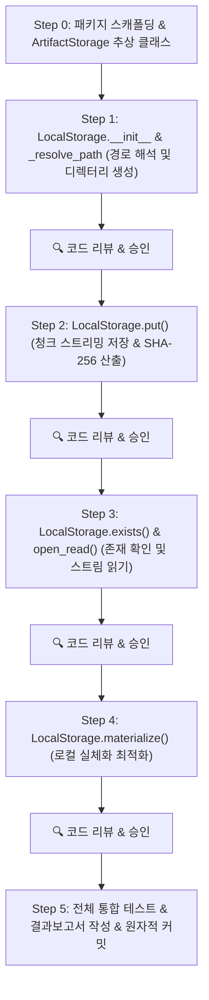

# LocalStorage 어댑터 함수 단위 점진적 구현 계획서

> **문서 상태:** 구현 완료 (Step 0–5, 전체 최종 리뷰 95/100)
> **관련 사양:** [docs/architecture/storage.md](../architecture/storage.md), [docs/domain/artifacts.md](../domain/artifacts.md), [docs/roadmap.md](../roadmap.md)  
> **진행 방식:** 한 번에 일괄 구현하지 않고, 함수 단위로 설계 ➔ 구현/TDD ➔ 사용자 코드 리뷰 ➔ 다음 함수 진행

---

## 1. 개요 및 목표

- [ArtifactStorage](../architecture/storage.md) 추상 인터페이스를 정의하고, 이를 상속한 `LocalStorage` 어댑터를 구현합니다.
- 모든 중간 및 최종 산출물은 `outputs/{job_id}/` 디렉터리 구조에 안전하게 격리 저장됩니다.
- 스트리밍 기반 SHA-256 자동 계산 및 [ArtifactRef](../domain/artifacts.md) 반환, 로컬 경로 실체화(`materialize`) 기능을 지원합니다.

---

## 2. 함수 단위 점진적 구현 로드맵



---

## 3. 단계별 세부 설계 및 리뷰 포인트

### Step 0: 패키지 스캐폴딩 & Base 인터페이스
- **파일:**
  - `packages/storage/pyproject.toml`
  - `packages/storage/musicsheet_storage/__init__.py`
  - `packages/storage/musicsheet_storage/base.py`
  - 루트 `pyproject.toml` 워크스페이스 연동
- **구현 내용:**
  - `ArtifactStorage(ABC)`에 `put`, `open_read`, `exists`, `materialize` 4개 추상 메서드 선언.
- **리뷰 포인트:** 추상 메서드 파라미터 시그니처 및 반환 타입 적합성 확인.

### Step 1: `LocalStorage.__init__` & `_resolve_path`
- **파일:** `packages/storage/musicsheet_storage/local.py`
- **함수:**
  ```python
  def __init__(self, base_dir: Path | str = "outputs") -> None: ...
  def _resolve_job_dir(self, job_id: str) -> Path: ...
  def _resolve_file_path(self, job_id: str, filename: str) -> Path: ...
  ```
- **구현 내용:**
  - `outputs/{job_id}/` 디렉터리 생성 (`mkdir(parents=True, exist_ok=True)`)
  - 경로 순회 공격(`..` 포함된 잘못된 job_id나 filename) 방어 및 정규화
- **리뷰 포인트:** 보안 경로 검증 로직 및 디렉터리 생성 정책.

### Step 2: `LocalStorage.put()`
- **함수:**
  ```python
  def put(
      self,
      job_id: str,
      filename: str,
      role: ArtifactRole,
      source: BinaryIO | Path,
      producer: str,
      producer_version: str,
  ) -> ArtifactRef: ...
  ```
- **구현 내용:**
  - `BinaryIO` 및 `Path` 입력 분기 처리
  - 대용량 오디오(WAV) 메모리 고갈 방지를 위해 64KB 청크 단위 스트리밍 복사
  - 실시간 SHA-256 해시 계산 및 파일 크기(`size_bytes`) 측정
  - MIME 타입 추론 및 `ArtifactRef` 객체 반환 (`id`는 UUID4 생성)
  - 목적지 이름이 작업 폴더 안의 심볼릭 링크면 링크 대상이 작업 폴더 안인지 확인한 뒤 링크 이름을 원자적으로 교체하고, 대상 파일은 보존
- **리뷰 포인트:** 스트리밍 I/O 안정성, 예외 처리, `ArtifactRef` 필드 무결성.

### Step 3: `LocalStorage.exists()` & `open_read()`
- **함수:**
  ```python
  def exists(self, artifact: ArtifactRef) -> bool: ...
  def open_read(self, artifact: ArtifactRef) -> BinaryIO: ...
  ```
- **구현 내용:**
  - `exists`: 물리 파일 존재 여부 검사
  - `open_read`: `FileNotFoundError` 방어, 읽기 전용 바이너리 스트림 반환 (`rb`)
- **리뷰 포인트:** URI 역참조 안전성 및 스트림 반환 규칙.

### Step 4: `LocalStorage.materialize()`
- **함수:**
  ```python
  def materialize(self, artifact: ArtifactRef, temp_dir: Path) -> Path: ...
  ```
- **구현 내용:**
  - 저장소 URI·job ID·파일명 경계를 검증하고 원본 파일이 없으면 `FileNotFoundError` 발생
  - `temp_dir` 아래에 충돌 없는 디렉터리와 파일 경로를 만들고, 원본을 가리키는 심볼릭 링크를 우선 사용
  - Windows 권한 등으로 링크를 만들 수 없으면 `temp_dir`에 파일을 복사해 인터페이스 계약을 유지
- **리뷰 포인트:** 임시 경로 격리, 파일명 안전성, symlink 실패 시 복사와 부분 파일 정리 확인.

### Step 5: 통합 테스트 & 결과보고서
- `tests/unit/test_storage.py` 전체 테스트 스위트 구동 (`uv run pytest`)
- `docs/reports/`에 커밋 단위 작업 결과보고서 작성
- `docs/roadmap.md` 작업 상태 갱신 (`Planned` ➔ `Done`) 및 원자적 커밋

---

## 4. 검증 계획

```bash
uv run pytest tests/unit/test_storage.py -v
```

- `test_storage_scaffold_and_base_interface`
- `test_local_storage_path_resolution`
- `test_local_storage_put_from_path_and_stream`
- `test_local_storage_exists_and_open_read`
- `test_local_storage_materialize`
