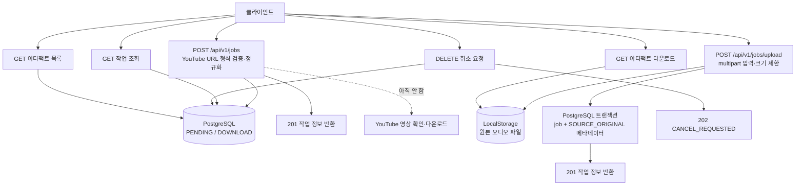
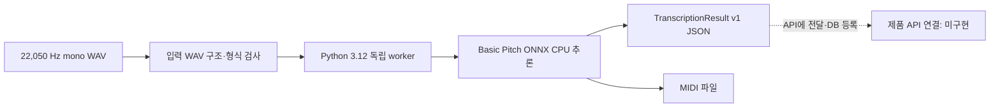

# MusicSheet 현재 구현 현황 브리핑

> 최신 상태(2026-10-04): opt-in Basic Pitch TRANSCRIBE 제품 연결의 Windows 실제 모델/DB·Linux 실행기/root 검증이 통과했습니다. 아래 내용은 당시 브리핑 기록이며 최신 결과는 [W04 보고서](basic-pitch-pipeline-implementation-report.md)와 [개발 현황](../roadmap.md)을 참조하세요.

> **2026-10-03 현재 작업 브랜치 추가:** `codex/redis-streams-sse`에는 W02 Redis 이벤트 발행 모듈과 SSE 재접속 재생 API를 구현했습니다. worker 자동 발행은 W03에서 연결합니다. API 222 passed/17 skipped; 실 Redis 7개는 URL 미설정으로 미검증입니다. 아래 본문은 기존 `148040c` 병합 시점의 기록이며 W02 추가 내용은 [W02 구현 보고서](redis-streams-sse-implementation-report.md)를 기준으로 확인합니다.

> **기준일:** 2026-10-01
>
> **구현 기준:** `origin/main` 커밋 `148040c` (2026-09-28). 이후 병합되는 변경은 이 문서의 범위에 포함되지 않습니다.

## 한눈에 보기

MusicSheet에는 데이터 모델, 로컬 아티팩트 저장, API 상태 확인, PostgreSQL 작업 저장, 입력 등록 및 결과물 전달의 기반이 구현되어 있습니다. Basic Pitch는 격리된 Python 3.12 프로세스에서 실제 추론해 JSON과 MIDI를 만들 수 있습니다.

아직 URL/업로드로 등록된 작업을 자동으로 처리하는 Celery 파이프라인은 없습니다. Basic Pitch worker도 API에 연결되지 않았고, 음원 분리, 리듬 보정, 악보 렌더링, 웹 앱도 구현 전입니다. 따라서 지금은 **작업 등록·저장·조회와 별도 전사 PoC까지**이며, 입력에서 최종 악보까지 이어지는 제품 흐름은 완성되지 않았습니다.

## 현재 구현된 구성

| 영역 | 구현된 내용 | 현재 역할과 경계 |
| --- | --- | --- |
| Python 프로젝트 | Python 3.13 `uv` 모노레포. API는 독립 `uv.lock`/환경을 가지며, Basic Pitch worker는 별도 Python 3.12 환경을 가짐 | API 의존성과 실험적 AI 의존성을 분리합니다. |
| 공용 도메인 모델 | 작업 상태·파이프라인 단계, 아티팩트 참조, note/pedal event, 박자·템포, 악보 note, versioned `TranscriptionResult` Pydantic 계약 | 서비스 간 데이터 모양을 정의합니다. 악보 모델이 존재해도 악보 생성·렌더링 기능이 구현됐다는 뜻은 아닙니다. |
| LocalStorage | 작업별 파일 저장·읽기·존재 확인·임시 경로 materialize·삭제, SHA-256 및 크기 기록 | 현재 파일 바이트 저장소입니다. S3는 아직 없습니다. |
| 개발 인프라 | Docker Compose의 PostgreSQL 16과 Redis 7 | 개발 의존 서비스 구성입니다. Redis Streams와 Celery 처리는 아직 연결되지 않았습니다. |
| FastAPI 상태 확인 | `/health/live`, `/health/ready`, `/health/detail` | 생존, PostgreSQL·Redis·스토리지 readiness, API 호스트의 GPU/FFmpeg/MuseScore 진단을 제공합니다. |
| PostgreSQL 작업 저장 | 명시 실행형 schema migration, `jobs`/`stage_attempts`/`artifacts` 및 migration ledger, 선택적 API connection pool, 작업·아티팩트 repository | PostgreSQL에는 작업 및 아티팩트 메타데이터를, LocalStorage에는 파일 바이트를 저장합니다. API 시작 시 migration을 자동 실행하지 않습니다. |
| Job REST API v1 | YouTube 등록, 오디오 업로드, 작업 상태 조회·취소, 아티팩트 목록·다운로드 | 작업 등록과 저장·전달을 제공합니다. 등록된 작업을 실제 처리하는 worker dispatch는 없습니다. |
| Basic Pitch PoC | 독립 CLI, WAV 입력 검사, ONNX CPU 추론, JSON/MIDI 출력 | 실제 추론 경로를 검증한 PoC입니다. API·DB·Celery와 연결되지 않았고 기본 전사 모델로 채택된 것도 아닙니다. |

## API 요청의 처리 흐름

### 등록 및 조회

- `POST /api/v1/jobs`는 허용된 HTTPS YouTube URL 형식과 영상 ID를 검사해 표준 URL로 정규화하고 작업을 생성합니다. `https://youtu.be/A9x7du4921A`는 오프라인 테스트 입력입니다. API는 이 요청 중 YouTube에 접속하거나 영상을 내려받지 않습니다.
- `POST /api/v1/jobs/upload`는 WAV, MP3, M4A, FLAC, OGG 파일 하나와 선택적인 `target_instrument`를 받습니다. 기본 최대 파일 크기는 100 MiB이며 multipart 전체 요청은 파일 제한에 64 KiB를 더한 값으로 제한됩니다. 사용자가 보낸 경로와 MIME 주장은 저장 경로 결정에 사용하지 않습니다.
- 업로드 파일은 먼저 LocalStorage에 기록하고, PostgreSQL 트랜잭션에서 작업과 `SOURCE_ORIGINAL` 아티팩트 메타데이터를 함께 등록합니다. 클라이언트 취소와 DB commit 결과를 고려해 파일 정리 및 트랜잭션 종료를 처리합니다. 프로세스가 파일 기록 후 DB commit 전에 중단되면 고아 파일이 남을 수 있습니다.
- `GET /api/v1/jobs/{job_id}`는 PostgreSQL의 작업 snapshot을 반환합니다. `DELETE`는 허용된 비종료 작업을 `CANCEL_REQUESTED`로 바꾸는 요청만 기록합니다. worker가 아직 없으므로 실제 실행 취소와 최종 `CANCELED` 전이는 수행되지 않습니다.
- 아티팩트 목록은 저장 메타데이터를 반환하고, 다운로드는 job ID와 artifact ID의 조합을 확인한 뒤 파일을 스트리밍합니다. API 응답에는 내부 저장 URI와 절대 로컬 경로를 노출하지 않습니다.

## Basic Pitch PoC의 별도 흐름

검증 보고서에는 CC0 fixture로 실제 추론을 실행해 유효한 note event 113개와 MIDI를 생성하고, JSON을 Python 3.13 공용 schema로 검증한 결과가 기록되어 있습니다. 기록된 실행은 해당 PC에서 2.016초였으며, 이 수치는 그 실행의 CLI 전체 시간입니다. 정확도 benchmark나 다른 장비의 성능 보장은 아닙니다. worker는 Python 3.12 및 pinned upstream commit의 ONNX CPU 경로를 사용하고, 기본 API 환경은 Python 3.13입니다.

## 완료·검증 기록

| 작업 | 검증 보고서 기준 결과 | 독립 리뷰 |
| --- | --- | ---: |
| LocalStorage | 기본 root suite 53 passed, 3 skipped, 4 deselected. Windows 권한으로 symlink 테스트 일부 skip | 95/100 |
| FastAPI health checks | API suite 30 passed; root suite 54 passed, 3 skipped, 4 deselected. Docker 데몬을 이용한 수동 readiness는 실행하지 못함 | 최종 98/100 |
| PostgreSQL persistence | PostgreSQL 16 통합 테스트 최종 재실행 9 passed; W01 전체 보고서의 추가 통합 확인 10 passed | 구현 단위 98/100, 97/100, 98/100; 전체 리뷰 97/100 |
| Basic Pitch 실제 추론 | 선택형 `ml_integration` 4 passed; 실제 추론으로 note event 113개와 MIDI 생성 | 97/100 |
| Job REST API v1 | API suite 151 passed, 10 skipped; PostgreSQL 통합 테스트 10 passed; root suite 59 passed, 4 skipped, 4 deselected | 구현 단위 99/100, 97/100, 96/100; 전체 96/100 |

이 표는 각각의 결과보고서에 기록된 실행 당시 수치입니다. 이번 문서 작성 과정에서는 테스트를 다시 실행하지 않았습니다. API의 현재 전체 검증 증거는 `docs/reports/job-rest-api-v1-implementation-report.md`, 각 이전 작업의 수치·환경 조건은 해당 `docs/reports/` 문서에서 확인해야 합니다.

## 아직 구현되지 않은 핵심 흐름

다음 기능이 연결되어야 등록 작업이 악보 결과까지 이어집니다.

1. **W02 Redis Streams와 SSE:** API/클라이언트가 진행 이벤트를 주고받고 재접속 시 이벤트를 복원합니다.
2. **W03 Celery orchestration:** 등록된 job을 큐에 넣고 다운로드, 후처리, 상태 업데이트를 실행합니다.
3. **W04 Basic Pitch 연결:** 격리 worker를 orchestration에서 실행하고 JSON/MIDI를 검증해 artifact로 등록합니다.
4. **W05–W08 음악 처리:** 기본 전사 모델 결정, 음원 분리, 리듬·퀀타이즈, MusicXML/PDF 악보 렌더링을 구현합니다.
5. **W09–W11 제품 흐름:** end-to-end 파이프라인, 웹 앱, 운영·배포를 구성합니다.
6. **W12 저장 확장:** LocalStorage 계약을 유지하며 필요 시 S3 adapter를 추가합니다.

기준 커밋의 `docs/backlog.md`에서 W02–W12는 Planned이며, `docs/roadmap.md`에는 진행 중인 작업이 등록되지 않았습니다. 전체 개발 순서는 backlog에서 관리합니다.

## 문서 기준과 한계

이 브리핑은 `148040c`에 병합된 구현을 요약합니다. 다른 브랜치에서 진행 중인 작업이나 이후 병합된 기능은 포함하지 않습니다. 테스트 수치 역시 각 결과보고서에 기록된 당시 실행 결과이며, 이 문서를 작성하면서 다시 측정한 값이 아닙니다.

## 참고 문서

- [작업 REST API 명세](https://github.com/reha-design/MusicSheet/blob/148040c333d797492ef74611b2a860c1eda8ac2a/docs/backend/api.md)
- [개발 작업 backlog](https://github.com/reha-design/MusicSheet/blob/148040c333d797492ef74611b2a860c1eda8ac2a/docs/backlog.md) — 기준 커밋
- [완료 작업 색인](https://github.com/reha-design/MusicSheet/blob/148040c333d797492ef74611b2a860c1eda8ac2a/docs/completed-work.md) — 기준 커밋
- [PostgreSQL 작업 영속성 보고서](https://github.com/reha-design/MusicSheet/blob/148040c333d797492ef74611b2a860c1eda8ac2a/docs/reports/postgresql-job-persistence-implementation-report.md) — 기준 커밋
- [Job REST API v1 보고서](https://github.com/reha-design/MusicSheet/blob/148040c333d797492ef74611b2a860c1eda8ac2a/docs/reports/job-rest-api-v1-implementation-report.md) — 기준 커밋
- [Basic Pitch smoke 보고서](basic-pitch-worker-smoke-report.md)
